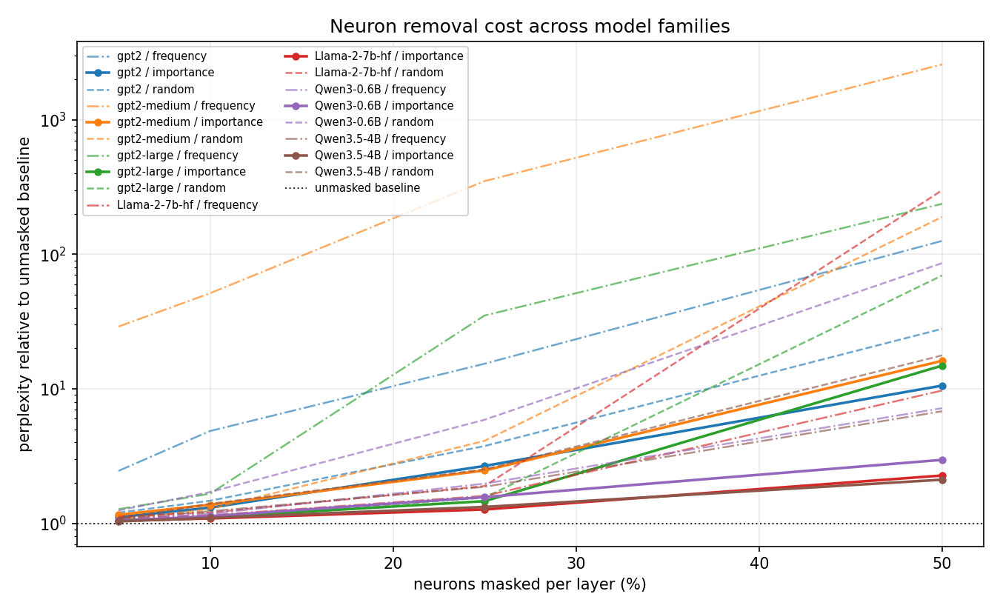

# Weeks 13–16 — Final Analysis

**Group 5 · Neuron / FFN-unit-level redundancy**
**Models:** GPT-2 124M / 355M / 774M · Qwen3-0.6B · Qwen3.5-4B (primary) ·
Llama-2-7B · Qwen3.5-9B
**Tasks:** WikiText-2 perplexity · PIQA accuracy
**Verdicts:** [`hypothesis_scoreboard.md`](hypothesis_scoreboard.md) is the single
frozen source of truth. This report is the argument; that file is the ledger.

---

## 1. What redundancy means at this granularity

A **neuron** is one post-activation channel of an FFN block — one entry of
`act_fn(gate(x)) ⊙ up(x)` on a gated model, or of `GELU(c_fc(x))` on GPT-2.
That vector is exactly the input to the down-projection, so a neuron reaches the
residual stream through a single weight column and its contribution is
`h_i · W_down[:, i]`.

We tested four candidate senses of "redundant", and they turned out to rank
neurons very differently:

| Sense | Operationalised as | Verdict |
|---|---|---|
| **Lazy** — rarely fires | frequency of \|a_i\| > α·RMS_ℓ | Almost useless. Saturates on SwiGLU (>99% of neurons fire on ~every token) and carries *negative* information on GELU. |
| **Low-contribution** | `RMS(h_i) · ‖W_down[:, i]‖` | **The signal that works.** Heavy-tailed, and drives every result below. |
| **Duplicated** | \|ρ\| ≥ 0.9 with another neuron in the layer | Real and common, but does *not* imply cheap to delete. Implies cheap to *replace*. |
| **Removable** | ΔPPL when masked | The ground truth the other three are proxies for — and the one they most often disagree with. |

We **mask** rather than structurally remove: a forward pre-hook zeroes the
channel on the way into `down_proj`, which removes the neuron's entire
contribution while leaving every parameter shape untouched. That is why **no
speed, memory, or FLOP claim appears anywhere in this project.** It also means
every intervention works unchanged on 4-bit models, which is what made
Llama-2-7B and Qwen3.5-4B reachable on an 8 GB card at all.

## 2. The headline result

**Importance-guided masking beats matched-sparsity random masking in every model
we tested, and the gap widens with the removal ratio.** Relative to each model's
own unmasked baseline:

| masked / layer | gpt2 | Qwen3-0.6B | Qwen3.5-4B | Llama-2-7B |
|---:|---:|---:|---:|---:|
| 10% | **1.31×** / 1.47× | **1.13×** / 1.71× | **1.10×** / 1.40× | **1.09×** / 1.20× |
| 25% | **2.67×** / 3.75× | **1.57×** / 5.89× | **1.32×** / 2.52× | **1.27×** / 1.89× |
| 50% | **10.57×** / 27.91× | **2.96×** / 85.93× | **2.11×** / 17.71× | **2.27×** / 299.10× |

(importance / random. Full table with the first six models and the frequency arm:
[`artifacts/cross_family_tables.md`](artifacts/cross_family_tables.md).)

**Llama-2-7B is the clearest demonstration in the project.** Masking half of
every FFN by importance costs 2.27× perplexity; masking the same *number* of
neurons at random costs 299× — a 132-fold difference. PIQA holds at 0.675
against a 0.765 baseline with half the FFN masked. Whatever the importance score
is picking up on, it is not weak, and it is not specific to one family.
Qwen3.5-9B, run later on a 16 GB card, agrees in direction and not in drama:
at 50%, importance is 2.06× its own baseline and random is 13.0×.



*(Log axis. Solid = importance, dash-dot = frequency, dashed = random; colour is
the model.)*

## 3. What generalises, and what does not

This is the part we would most want a reader to take away, because most of it
contradicts what we predicted in the proposal.

### 3.1 The ranking generalises; the cheap heuristic does not

Our original plan ranked neurons by firing frequency, following the Lazy Neuron
phenomenon. That plan was wrong twice over. On SwiGLU models the signal
saturates, which we caught in Weeks 5–8 and worked around by promoting the
importance score. On GELU models it is worse than saturated — it is
**actively misleading**:

| masked / layer | gpt2 | gpt2-medium | gpt2-large | Qwen3-0.6B | Qwen3.5-4B | Llama-2-7B |
|---:|---:|---:|---:|---:|---:|---:|
| 25% | 15.36× / 3.75× | 349.77× / 4.10× | 35.03× / 1.55× | **1.97×** / 5.89× | **1.87×** / 2.52× | **1.60×** / 1.89× |
| 50% | 125.72× / 27.91× | 2577.74× / 189.49× | 237.12× / 69.60× | **7.18×** / 85.93× | **6.81×** / 17.71× | **9.71×** / 299.10× |

(frequency / random; **bold** = frequency beats random.) Frequency loses to
random on **0 of 12** GELU comparisons and wins on **11 of 12** SwiGLU ones in
the table above. On `gpt2-medium` at 50% it is 13× *worse* than picking neurons
at random. Qwen3.5-9B, not in that table, continues the gated pattern at every
ratio we ran (5/10/25/50%): frequency beats random and loses to importance.

The split follows FFN design, but the quiet-neuron story only explains part of
it. At α = 0.25, Llama-2 and Qwen3-0.6B have a real quiet subpopulation (3.12%
and 4.30%). GELU models have essentially none (0.02–0.05%), and GELU is smooth
and effectively always on, so firing frequency says almost nothing about whether
a neuron matters. Qwen3.5-4B and Qwen3.5-9B are also at ~0% lazy neurons at that
threshold, and frequency still beats random on both. So the *ordering* of firing
rates carries signal in those gated FFNs even when nothing is quiet enough to
cross the threshold. The measurement records how many neurons fall below it, not
how the rates are distributed, and that is why it cannot say what the signal is.

**Practical consequence: frequency-based pruning heuristics should not be
transferred across FFN designs without re-validation.** Importance transferred;
frequency did not. Three GPT-2 sizes rule out "GPT-2 small is just an odd little
model", and two vendors on the gated side rule out a Qwen quirk.

### 3.2 Neither depth nor size predicts redundancy the way we assumed

Both structural hypotheses failed, and each failed for an instructive reason.

**H1 (depth) — refuted, and the proxy was the problem.** We predicted middle
layers would be *less* redundant, following Geva et al. on the key-value role of
middle FFNs. Through Weeks 5–10 we scored this from the static bottom-10%
importance share, and on the GELU models it agreed: the middle tertile held the
largest share of importance in its cheapest neurons, i.e. least spare mass. Then
we ran the ablation the proxy was standing in for — mask 10% of each tertile,
measure the cost:

| model | early ΔPPL | middle ΔPPL | deep ΔPPL | most expensive |
|---|---:|---:|---:|---|
| gpt2 | **+5.24** | +4.08 | +2.31 | early |
| gpt2-medium | **+7.06** | +2.92 | +1.77 | early |
| gpt2-large | +1.06 | +0.98 | +1.01 | flat |
| Qwen3-0.6B | **+2.69** | +0.19 | +0.81 | early |
| Qwen3.5-4B | +0.34 | +0.37 | **+1.02** | deep |
| Qwen3.5-9B | +0.16 | +0.14 | **+0.57** | deep |
| Llama-2-7B | +0.27 | +0.10 | **+0.42** | deep |

**The middle tertile is never the most expensive one**, in any of the seven models. H1 is refuted. Beyond
that, the two model groups point in opposite directions — early layers are the
costly ones on GPT-2 and Qwen3-0.6B, deep layers on Qwen3.5-4B, Qwen3.5-9B and
Llama-2-7B — so there is no single depth story to tell.

The methodological point is the more useful one: **the static proxy and the
ablation disagree, and the proxy loses.** On GPT-2 the proxy nominated the
middle tertile while masking the early tertile cost more than twice as much. An
importance score ranks neurons well *within* a layer, which is what §2 relies
on; it does not predict what a whole layer's removal costs, because it ignores
how the rest of the network absorbs the loss. We would not have caught this
without running the ablation per tertile.

**H2 (size) — refuted as stated.** The cross-family ordering looks like
textbook H2: at 25% masking the relative cost falls almost monotonically with
size (GPT-2 124M 2.670× → Qwen3-0.6B 1.566× → Qwen3.5-4B 1.323× →
Llama-2-7B 1.267×). But that varies size *and* architecture *and* training
corpus together. GPT-2 small/medium/large vary only size:

| model | params | rel PPL @ 10% | @ 25% | @ 50% | bottom-10% imp. share |
|---|---:|---:|---:|---:|---:|
| gpt2 | 124M | 1.307 | 2.670 | **10.565** | 6.45% |
| gpt2-medium | 355M | 1.374 | 2.470 | 16.153 | 6.59% |
| gpt2-large | 774M | **1.109** | **1.461** | 14.874 | 6.58% |

H2 holds at 25%, where cost falls 45% from small to large. It fails at 50%,
where **both larger models are worse than the smallest**, and at 10%, where
medium is worse than small. And the static redundancy profile barely moves
across a 6× parameter range — 6.45 / 6.59 / 6.58%, with the strongest
correlated pair ≈1.0 in all three. **Within a family, scaling does not make
neurons more redundant by these measures**; it changes how gracefully the model
absorbs their removal, and only in part of the range.

The second clause of H2 — that the guided-vs-random *gap* grows with size —
fails too, and in the opposite direction: within Qwen it shrinks (3.76× at 0.6B,
1.90× at 4B, 1.61× at 9B, all at 25% masking). The 9B point uses its own
in-run baseline (15.36 on 79 documents, not the 12.90 full-split number).

Two caveats keep us honest. Larger GPT-2 models are better models to begin with
(baseline PPL 51.65 → 36.65 → 31.99), so at high sparsity they have further to
fall. And the 50% arm is deep in the regime where all three are destroyed, so
its ordering is the least meaningful of the three.

**In our data, FFN design predicts pruning tolerance better than parameter
count does.** Llama-2-7B is 1.8× the size of Qwen3.5-4B and only slightly
cheaper to prune at 25% (1.267× vs 1.323×), while the 12× jump from Qwen3-0.6B
to Qwen3.5-4B buys more.

### 3.3 Redundancy is partly task-relative — but only on gated models

H3 predicted that neurons which look redundant under WikiText-2 are not
redundant under PIQA. We re-ran the entire measurement on PIQA-prompt
calibration and compared both the nominated sets and the resulting behaviour.

The two corpora nominate substantially different neurons everywhere — Jaccard
overlap at a 10% budget is 0.33 on Qwen3-0.6B (6.3× chance), 0.17 on GPT-2
(3.3×), 0.14 on Llama-2 (2.6×) — so they are far from independent but far from
identical. What matters is whether that disagreement changes behaviour:

| model | budget | WikiText ranking | PIQA ranking | random | H3 |
|---|---:|---|---|---|---|
| Llama-2-7B | 25% | 11.99 PPL / 0.750 acc | 14.31 PPL / **0.785 acc** | 17.89 / 0.695 | **supported** |
| Qwen3.5-4B | 25% | 24.98 PPL / 0.705 acc | 33.14 PPL / **0.755 acc** | 47.54 / 0.675 | **supported** |
| Qwen3-0.6B | 25% | 52.86 PPL / 0.594 acc | 94.80 PPL / **0.630 acc** | 198.74 / 0.594 | **supported** |
| gpt2 | 25% | **137.89 PPL / 0.562 acc** | 311.68 PPL / 0.544 acc | 193.86 / 0.570 | not supported |

On the three gated models this is a clean **double dissociation**: each ranking
wins on the corpus it was calibrated on, and the PIQA-calibrated ranking buys
+3.5 pp (Llama-2), +5.0 pp (Qwen3.5-4B), and +3.6 pp (Qwen3-0.6B) of PIQA
accuracy. On Llama-2 the PIQA-ranked 25% mask actually scores *above* the
unmasked baseline (0.785 vs 0.765), within noise but striking.

On GPT-2 there is no dissociation at all: the PIQA-calibrated ranking is worse
on both metrics, and worse than **random** on perplexity. That is the same
GELU/SwiGLU split as the frequency result, and we think it has the same cause —
on an always-on FFN, a calibration corpus as small and as narrow as PIQA prompts
produces a ranking dominated by corpus artifacts rather than by what the neuron
does.

So the correct statement is **partial, architecture-dependent task
specificity**: a shared core of genuinely cheap neurons, plus a task-dependent
margin that is real on gated FFNs and absent on GELU. And a
WikiText-calibrated ranking still beats random on PIQA at every ratio in every
model — calibrating on the wrong corpus costs accuracy, it does not make the
ranking worthless.

## 4. The duplicate-neuron story — drop versus replace

This is the thread that started from Haoyi's review comment, and it produced our
most interesting result by way of our most embarrassing one.

### 4.1 H5: dropping one twin is not cheap

Near-duplicate neurons are everywhere. The maximum \|ρ\| within a layer is
≈1.000 in GPT-2 124M, 0.997–0.999 in GPT-2 355M/774M, Llama-2 and Qwen3-0.6B.
H5 predicted that masking **one** twin of such a pair should cost less than
masking an uncorrelated neuron of matched importance, since the survivor could
partly cover for it.

| model | pairs | drop one | matched control | margin | control coverage | verdict |
|---|---:|---:|---:|---:|---:|---|
| gpt2 | 22 | +1.164 | −0.688 | −1.852 | 0.57× | False |
| gpt2-medium | 15 | +0.004 | +0.267 | +0.263 | **1.01×** | True |
| gpt2-large | 16 | −0.119 | +0.034 | +0.153 | 0.65× | True |
| Qwen3-0.6B | 14 | +2.241 | −0.279 | −2.520 | 0.60× | False |
| Qwen3.5-4B | 4 | −0.013 | +0.033 | +0.046 | **1.00×** | True |
| Qwen3.5-9B | 4 | +0.012 | −0.003 | −0.015 | **1.00×** | False |
| Llama-2-7B | 17 | +0.044 | −0.204 | −0.248 | **0.94×** | False |

**Three supported, four not, so H5 as stated is not supported.** We report this
as "no consistent sign" rather than "refuted". Adding Qwen3.5-9B does not
create a sign: four pairs, a perfectly matched control, and a margin of 0.015
PPL, which is the noise floor again.

Through Weeks 9–10 we explained the failures away as a broken control: where the
duplicates were massive-activation outliers, no uncorrelated neuron in the layer
came close to their importance (coverage 0.57–0.60×), so the control arm was a
materially easier ablation. Llama-2 killed that excuse — with 11008 neurons per
layer its control reaches **0.94×**, a genuinely matched comparison, and H5
still fails. Then `gpt2-medium` and `gpt2-large` flipped the verdict the other
way. Restricting to the models with fair controls (≥0.94×) does not rescue either
side: margins of +0.263, +0.046, −0.015 and −0.248 PPL, on 4–17 pairs, are
noise-floor effects. The two *large* margins both come from runs whose control
was unmatched.

We also retired a piece of evidence we had leaned on. Masking the *second* twin
costs far more than the first — dramatically so on Qwen3-0.6B (1287×) and
`gpt2-medium` (53,000×) — and we read that as "the survivor absorbed its
partner's job". But the procedure masks the **lower-importance** twin first, so
the second twin is the more important neuron by construction, and that alone
explains the gap. The asymmetry is consistent with our story but does not
distinguish it from "important neurons cost more to remove".

### 4.2 H5′: replacing one twin is cheap, in proportion to fit quality

The confound-free version of the question is not "is this neuron cheap to
delete?" but "is its information available elsewhere?" — and that can be asked
by comparing two treatments of the **same** neuron.

We fit `h_drop ≈ α·h_keep + β` by least squares on calibration activations and
route the dropped twin's contribution through its partner with a hook. Same
pairs, same eval slice, same seed as §4.1:

| model | pairs | mean r² | mask only | after merge | masking cost undone |
|---|---:|---:|---:|---:|---:|
| gpt2 | 22 | 0.902 | +1.164 | **−0.023** | **102%** |
| Qwen3-0.6B | 14 | 0.892 | +2.241 | +0.284 | **87%** |
| Llama-2-7B | 17 | 0.618 | +0.044 | +0.023 | **47%** |

**Merging beats masking in all three families, and how much it recovers tracks
how linearly predictable the twin is** — r² 0.902 → 102%, 0.892 → 87%,
0.618 → 47%, in order. That relationship is the mechanistic claim: replacement
works exactly to the extent that one twin is a linear function of the other,
which is what "redundant" ought to mean. Two fitted scalars per pair buy roughly
what 200 LoRA steps buy, at essentially zero cost and with no training.

Three details that make this more than a curve fit:

- **The gain matters, the offset does not.** Dropping β changes nothing
  (≤0.02 PPL everywhere), but the fitted α is far from 1 (mean \|α\| ≈ 0.36–0.74).
  That is precisely *why* plain masking fails: correlation fixes the shape of
  the relationship but not the scale, so α has to be fitted rather than read off
  ρ.
- **Correlation alone does not predict merge value.** Qwen3-0.6B's deep layer
  has the *best* fits (r² 0.965, \|ρ\| up to 0.997) yet merging there is
  pointless, because those neurons were already free to drop — re-injecting
  their contribution moves perplexity the wrong way. **Merge where masking
  hurts; drop by importance where it does not.**
- **Where masking was already free, there is nothing to recover.** On
  `gpt2-medium`, `gpt2-large` and Qwen3.5-4B the drop-one arm cost ≤0.01 PPL.
  Qwen3.5-9B is the same case: four pairs, +0.012 PPL to mask, mean r² 0.42,
  and "28% recovered" is noise. The "% recovered" column there is meaningless.
  We report it as n/a rather than as a low score.

Llama-2 recovers least because its pairs are the loosest (mean r² 0.618, worst
pair 0.082): pairs selected on activation correlation over a short calibration
slice do not all hold up. Its absolute stakes are also tiny (+0.044 PPL to mask
17 of 352,256 neurons), so it is the least informative of the three arms despite
being the largest model.

**The claim to carry forward: duplicated neurons are cheap to *replace*, in
proportion to how well one predicts the other — not cheap to remove.** Naive
masking throws the shared information away; merging keeps it.

## 5. Recovery (H8)

Does short fine-tuning undo the cost of masking? **The control is the whole
methodology here.** A LoRA budget spent on WikiText-2 improves perplexity on its
own — on Qwen3-0.6B it takes the *unmasked* model from 33.75 to 23.08 — so
recovery measured against the untrained baseline reads 318% and means nothing.
Every run therefore trains an unmasked control at the identical budget, and we
report `1 − (recovered − control) / damage`.

| model | ratio | budget | masked | + LoRA | unmasked + LoRA | residual | **adj. recovery** |
|---|---:|---:|---:|---:|---:|---:|---:|
| gpt2 124M | 10% | 819k tok | 67.50 | 36.86 | 33.66 | +3.19 | **80%** |
| gpt2 124M | 25% | 819k tok | 137.89 | 44.52 | 33.66 | +10.86 | **87%** |
| gpt2-medium 355M | 10% | 819k tok | 51.08 | 26.39 | 24.12 | +2.27 | **84%** |
| gpt2-medium 355M | 25% | 819k tok | 91.80 | 30.16 | 24.12 | +6.04 | **89%** |
| gpt2-large 774M | 10% | 819k tok | 36.00 | 22.51 | 21.65 | +0.86 | **76%** |
| gpt2-large 774M | 25% | 819k tok | 47.44 | 24.70 | 21.65 | +3.05 | **80%** |
| Qwen3-0.6B | 10% | 819k tok | 38.15 | 24.15 | 23.08 | +1.07 | **76%** |
| Qwen3-0.6B | 25% | 819k tok | 52.86 | 26.33 | 23.08 | +3.25 | **83%** |
| Llama-2-7B (4-bit) | 10% | 819k tok | 13.33 | 19.45 | 18.13 | +1.32 | **−6%** |
| Llama-2-7B (4-bit) | 25% | 819k tok | 16.07 | 20.19 | 18.13 | +2.06 | **48%** |
| Qwen3.5-4B (4-bit) | 10% | **51k tok** | 20.71 | 27.59 | 25.80 | +1.79 | **2%** |

(Generated table, including raw recovery and untrained baselines:
[`artifacts/h8_recovery.md`](artifacts/h8_recovery.md).)

Two findings, and a third that the matched-budget run settled.

1. **Most of the masking damage is recoverable below about 1B parameters.**
   Four models at an identical 819k-token budget land in a narrow band: 80/87%
   (124M), 84/89% (355M), 76/80% (774M), 76/83% (Qwen3-0.6B) — despite different
   architectures and tokenizers. The share recovered is *higher* at 25% than at
   10% in every one of those four, because there is more headroom to reclaim
   even though the absolute residual is larger.
2. **At 7B the same budget overfits, and recovery leaves the band.** Llama-2-7B
   was trained at the identical 819k tokens (200 steps, batch 2, accumulation 4,
   sequence 512, both ratios, unmasked control). Train loss fell (1.90 → 0.54 on
   the control) while eval perplexity rose on every arm: the unmasked model goes
   from 12.09 to 18.13. Adjusted recovery is **−6% at 10%** and **48% at 25%**.
   PIQA moves the same way: 0.760 unmasked, 0.740 after LoRA on the control,
   0.725 after LoRA on the 10% mask. This is the 4B signature — loss down, eval
   perplexity up — at the budget the smaller models recover on.
3. **The 4B row is still not a matched comparison.** Its budget is **16×
   smaller**: 100 steps at batch 1 with no gradient accumulation and a 128-block
   pool, against 819k tokens for every other row. Adjusted recovery is
   internally fair there, because both arms shared that budget, but its 2%
   cannot be lined up against 76–89% by itself. The 7B run is what separates the
   two readings. A smooth size effect across GPT-2 (at most 9 pp from 124M to
   774M: 80/87% → 84/89% → 76/80%) cannot reach 2%, so the 4B number was never
   that trend extrapolated. It also was not "just too few tokens": the same
   token budget that recovers a 774M model overfits a 7B one. We are not
   claiming 7B masking is permanent. One recipe was tried, and a shorter
   schedule might still recover. We are claiming that **at this budget,
   recovery holds through 774M and Qwen3-0.6B and fails at 7B.**

   | | 124M | 355M | 774M | Llama-2-7B |
   |---|---:|---:|---:|---:|
   | 10% masked | 80% | **84%** | 76% | **−6%** |
   | 25% masked | 87% | **89%** | 80% | **48%** |

Qwen3.5-9B recovery was not run. The 7B result answers the same question, so
that arm stays closed.

On the small models, recovery also helps PIQA at high sparsity: Qwen3-0.6B goes
0.594 → 0.652 at 25% masking even though the adapters never saw a PIQA prompt.
WikiText LoRA very slightly *hurts* PIQA on that control (0.698 → 0.694). On
Llama-2-7B the same LoRA hurts PIQA on both arms, which matches the perplexity
overfit rather than the small-model pattern.

### Against the proposal's success criteria

We promised ΔPPL < +1 and PIQA drop < 2 pp at 10% masking. Without recovery this
is **not met** (Qwen3.5-4B +1.82 PPL, Qwen3-0.6B +4.40). With recovery at equal
adapter budget, Qwen3-0.6B lands at **+1.07 PPL and −2.2 pp** — just outside
both. It *is* met on perplexity at 5% on the 4B (+0.64 PPL, PIQA −1.5 pp). The
criteria were written before we understood that pure masking without recovery is
a strictly harder setting than they assumed.

## 6. Reproducing this

Environment is `uv`-managed; every result JSON records the model, dataset, seed,
intervention, and the exact command that produced it.

```powershell
uv sync
uv run pytest tests/ -q          # 76 offline tests, no GPU and no downloads

# 1. Baseline (Weeks 1-2)
uv run python scripts/run_baseline.py    --config configs/eval/baseline_full.yaml

# 2. Measurement (Weeks 5-8) - writes the .json + .npz every later stage replays
uv run python scripts/run_measurement.py --config configs/measurement/neuron_activations.yaml

# 3. Masking sweep vs random baseline (Weeks 9-10)
uv run python scripts/run_pruning.py     --config configs/pruning/neuron_masking.yaml

# 4. Duplicate pairs: drop (H5) then replace (H5')
uv run python scripts/run_pair_ablation.py --config configs/pruning/pair_ablation.yaml
uv run python scripts/run_merge.py         --config configs/pruning/merge_qwen3_0.6b.yaml

# 5. Recovery (H8)
uv run python scripts/run_recovery.py    --config configs/recovery/lora_qwen3_0.6b.yaml

# 6. Task dimension (H3)
uv run python scripts/run_measurement.py  --config configs/measurement/neuron_activations_piqa_qwen3_0.6b.yaml
uv run python scripts/run_task_overlap.py --config configs/measurement/task_overlap_qwen3_0.6b.yaml `
    --reference <wikitext measurement json> --comparison <piqa measurement json>
uv run python scripts/run_pruning.py      --config configs/pruning/neuron_masking_piqa_ranked_qwen3_0.6b.yaml `
    --measurement <piqa measurement json> --tag piqaranked
```

Swap the config prefix to retarget a model: `configs/*/[...]_gpt2.yaml`,
`_gpt2-medium`, `_gpt2-large`, `_llama2-7b`, `_qwen3_0.6b`, `_qwen3.5-4b`.
`scripts/run_cross_family_followups.py` runs the whole cross-model matrix and
skips any stage whose artifact already exists.

Every table in `reports/group_5/artifacts/` regenerates from the JSONs on disk,
no GPU, in a few seconds:

```powershell
uv run python scripts/compare_families.py --model gpt2 --model gpt2-medium `
    --model gpt2-large --model meta-llama/Llama-2-7b-hf `
    --model Qwen/Qwen3-0.6B --model Qwen/Qwen3.5-4B `
    --out reports/group_5/artifacts/cross_family_tables.md --logy
uv run python scripts/summarize_h1_depth.py
uv run python scripts/summarize_hypotheses.py

# Seed stability of the random baseline - reads the .npz only, no forward passes
uv run python scripts/random_selection_stability.py `
    --measurement experiments/results/measurement_gpt2_20260814T105354Z.json `
    --ratios 0.05 0.10 0.25 0.50 --seeds 20
```

### Two infrastructure notes

Both cost hours to diagnose and look like broken experiments rather than broken
tools.

**Downloading.** `huggingface_hub.snapshot_download` stalled at 0 bytes on large
shards on this machine, with and without `HF_HUB_DISABLE_XET=1`, while small
files downloaded fine. Use `scripts/download_model.py` (plain ranged HTTP). It
retries with resume when a connection drops mid-shard and skips `onnx/`, which
both crashed the download and would have pulled a second copy of the weights.

**Loading sharded checkpoints on Windows.** Llama-2 killed the interpreter with
an access violation and no traceback. Not corruption — both shards match their
SHA256. `safetensors.safe_open` memory-maps the checkpoint, so reading a weight
is an ordinary memory access, and when Windows cannot service the page fault
(13.5 GB of mappings against ~4 GB of free RAM) the process dies rather than
raising. `src/redundancy/safetensors_pread.py` reads each tensor's byte range
with ordinary file reads instead; it is enabled automatically on Windows and
`REDUNDANCY_DISABLE_PREAD_SAFETENSORS=1` turns it off. Transformers' own
`disable_mmap` is not usable here because it reads whole shards into RAM.

## 7. Limitations and what we are not claiming

Stated plainly, because several of these are load-bearing.

**Method**

- **Masking ≠ removal.** Shapes never change; every intervention is a forward
  hook. No speed, memory, or FLOP claim is made. A structural version (fold
  `α·W[:, i]` into `W[:, j]` and delete the column) is a straightforward
  follow-up on an unquantized model.
- **The importance score is a separable proxy** for the true, non-separable L2
  contribution of a neuron across tokens. Good for ranking; not an exact
  ablation ΔPPL. §3.2 is a direct demonstration of where the proxy breaks.
- **Single random draw per ratio, and only the *selection* half is bounded.**
  Every `random` column is one seeded sample at seed 42, not an average with
  error bars. We bounded the part that can be bounded offline: resampling the
  draw 20× per ratio on all six measurements shows the guided arm sits at worst
  **21.4 seed standard deviations** from the random arm's removed-importance
  distribution, and mean pairwise Jaccard between draws lands on the analytic
  chance floor to four decimals, so the draws are independent and no reported
  gap is a draw artifact ([`random_selection_stability.md`](random_selection_stability.md)).
  What that does **not** give is a confidence interval on any perplexity. Where
  the reported gap is large this is immaterial; where it is 0.02× baseline —
  `gpt2-medium` and `gpt2-large` at 5–10%, the cells where random *beats* the
  importance ranking — it is the whole question, and those cells need a
  multi-seed GPU re-run. Notably the selection separation there is 48–136 sd, so
  the guided arm provably removes *less* importance mass and still costs more
  perplexity: another instance of §3.2's point that a static score does not
  order ablation cost.
- **Correlation pairs are a sample, not a census** — three drill-down layers per
  model, from a reservoir subsample. Pair counts are small and uneven: 22 / 15 /
  16 / 14 / 17 / 4 / 4, so every H5 and H5′ number rests on tens of neurons.
- **Scalar substitution only** in the merge: one survivor per dropped neuron,
  one gain, one offset. The low-r² pairs show the limit of that model;
  regressing on several survivors is the obvious next step.
- **Merge coefficients are fitted and evaluated on WikiText-2.** A pair whose α
  shifts across corpora would merge worse than reported.

**Coverage**

- **Two evaluation tasks**: WikiText-2 perplexity and PIQA accuracy. No visual
  or multimodal benchmark was run, even though Qwen3.5-4B is an image-text
  hybrid whose vision projections we hook but never exercise (#12). We consider
  this the biggest gap in breadth.
- **Qwen3.5-9B** has measurement, a full masking sweep, the H1 tertile
  ablation, pair ablation, and merge. It does not have a LoRA arm, and it does
  not need one: Llama-2-7B at the matched budget already answers H8. Its
  in-run perplexities use 79 WikiText-2 documents (baseline 15.36), not the
  full-split baseline of 12.90, so only ratios against that in-run baseline
  are quoted above.
- **Llama-2-7B recovery was run** at 819k tokens on a 16 GB card. Adjusted
  recovery is −6% at 10% and 48% at 25%; both arms overfit. A shorter schedule
  was not tried, so this is one recipe, not a proof that 7B masking is
  permanent.
- **H3 rests on one task pair** (WikiText-2 vs PIQA) and one prompt rendering.
  Qwen3.5-9B was not included.
- **One LoRA recipe**, rank 16. The runs that recover used 200 steps at batch 2
  × accum 4 (819k tokens). The 4B used 100 steps at batch 1 (51k tokens). The
  7B used the 819k recipe and did not recover. "76–89% recoverable" is the
  result below about 1B parameters, not a ceiling and not a result at 7B.

**Comparability**

- **GPT-2's context window is 1024** versus 2048 for the Qwen and Llama runs, so
  absolute perplexity is not comparable across those two groups. Every
  cross-model number in this report is normalised to each model's own baseline.
- **Llama-2-7B and Qwen are evaluated in 4-bit NF4 while GPT-2 is fp32.** This
  works *against* the Llama result rather than inflating it — a quantized model
  has less headroom, not more.
- **The architecture contrast rests entirely on GPT-2**, which is small and old.
  A modern non-gated model would be a better control, but there are few, so
  "GELU" and "GPT-2" are not fully separable in §3.1.
- **Eval subsets, not full splits**, inside the intervention runs (128–256
  documents; PIQA capped at 200–500 examples). All comparisons are within-run so
  the gaps are unaffected, but absolute values differ from the Weeks 1–2
  full-split baselines.

## 8. Conclusion

At neuron granularity, redundancy is **real, rankable, and transferable**: an
activation-aware importance score identifies FFN neurons that can be masked far
more cheaply than random ones, in all seven models we swept, across three
families and two FFN designs, with the effect strongest on Llama-2-7B (2.27×
versus 299× at 50% sparsity). That is the finding we would defend.

Almost everything else we predicted was wrong, and the pattern in *how* it was
wrong is the more interesting result. The cheap proxies for redundancy do not
survive contact with a second architecture — firing frequency is worse than
random on every GELU model — and the structural intuitions do not survive
contact with a clean experiment: neither depth nor parameter count predicts
redundancy once the confounds are separated, and the static importance proxy
that supported our depth hypothesis was contradicted by the ablation it was
standing in for. In our data, FFN design is a better predictor of pruning
tolerance than model size.

The duplicate-neuron thread ended up teaching us the most, and it only exists
because of a review comment. Duplicated neurons are **not** cheap to delete —
we could not get a consistent sign on that across seven models — but they are
cheap to **replace**, and the fraction of the cost that replacement recovers is
predicted by how well one twin linearly predicts the other (r² 0.90 → 102%,
0.89 → 87%, 0.62 → 47%). Two fitted scalars and no training buy roughly what a
200-step LoRA buys. That is a sharper notion of redundancy than "cheap to
remove": the information was never spare, it was simply *available elsewhere*,
and an intervention that preserves it costs almost nothing while one that
discards it does not.

---

## Appendix — deliverables map

| Seminar deliverable | Where |
|---|---|
| Short literature summary | `proposal_week3-4.md` Q2 |
| Definition of redundancy at this granularity | §1 here; `proposal_week3-4.md` Q1 |
| Working measurement implementation | `src/redundancy/metrics/`, `scripts/run_measurement.py`; `measurement_week5-8.md` |
| At least one intervention experiment | masking, pair ablation, merge, LoRA recovery — §2, §4, §5 |
| Comparison against a random baseline | §2 (every masking curve has a matched-sparsity random arm) |
| Clean code + reproducibility instructions | §6; 76 offline tests |
| Final result files and figures | `experiments/results/` (JSON + `.npz`), `reports/group_5/artifacts/` |
| Final slides | `final_slides_week15-16.md` |
| Short written report | this file |

| Stage | Report |
|---|---|
| Weeks 1–2 pipeline + baseline | `baseline_week1-2.md` |
| Weeks 3–4 proposal (+ datasets, metrics, dimensions, limitations, slides) | `proposal_week3-4.md` and siblings |
| Weeks 5–8 measurement | `measurement_week5-8.md` |
| Weeks 9–10 intervention | `intervention_week9-10.md` |
| Weeks 11–12 recovery, replacement, task | `recovery_week11-12.md` |
| Weeks 13–14 cross-family generalisation | `cross_family_week13-14.md` |
| Weeks 13–16 final analysis | this file |
| Frozen hypothesis verdicts | `hypothesis_scoreboard.md` |

## References

- Geva et al. 2021 — *Transformer Feed-Forward Layers Are Key-Value Memories*
- Ma, Fang & Wang 2023 — *LLM-Pruner: On the Structural Pruning of Large Language Models*
- Sun et al. 2023 — *A Simple and Effective Pruning Approach for Large Language Models* (Wanda)
- Li et al. 2022 — *The Lazy Neuron Phenomenon: On Emergence of Activation Sparsity in Transformers*
